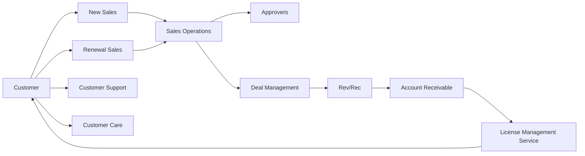

# Sales Operationの機能と役割

## 1. Sales Operationの基本理念

Scalar社のSales Operationは、**顧客のConversion Circleを仕組化**し、**柔軟かつ迅速**なビジネス成長を支える中核機能として位置づけられています。

### 1.1 基本的な考え方

#### 🔄 顧客Conversion Circleの仕組化
```
新規顧客 ➤ 既存顧客 ➤ 更新顧客 ➤ 買増顧客
```
顧客の囲込み（Retention）を継続的に推進し、長期的な収益最大化を実現します。

#### 📈 スケーラブルな成長対応
顧客増加に伴う以下の業務量増加に**柔軟かつ迅速**に対応：
- 見積数・契約数・請求書数・入金数・更新数・買増数の全てが増加

#### 🔗 Source-To-Settleプロセス対応
発注者（Users/Partners）の複数発注チャネルに対応し、同一法人内の複数部門からの発注も統合管理。

#### 🌐 Multi-Channel Selling対応
新規・既存顧客両方に対して、Direct / Partner / Marketplace等の複数販売網に柔軟に対応。

---

## 2. Sales Middle Officeの機能体系

Sales Operationは、**Front Office（営業）** と **Back Office（管理）** を繋ぐ **Middle Office** として、以下6つの主要機能を担います。

### 2.1 機能別役割分担

| 機能 | 主要責任 | フロント度 | バックオフィス度 |
|------|----------|------------|-----------------|
| **Sales Operations** | User・案件の調整、既存ライセンス状況チェック | ◎ | △ |
| **Approvers** | 申請案件の整理と承認（値引き・契約条文変更等） | ○ | ◎ |
| **Deal Management** | 見積書・契約書の作成、コンプライアンスチェック | ○ | ◎ |
| **Rev/Rec** | 収益認識の可否判断、承認事項と契約内容の再チェック | X | ◎ |
| **Account Receivable** | 請求・回収・督促、未回収報告 | △ | ◎ |
| **License Management Service** | ライセンス使用状況の監査 | ○ | ○ |

---

## 3. 各機能の詳細解説

### 3.1 Sales Operations

**役割**：Sales/Renewal Salesに伴走して、User・案件の調整を担当

#### 主要機能（フロント度 vs バックオフィス度）

| No. | 機能 | フロント度 | バックオフィス度 |
|-----|------|------------|-----------------|
| 1 | 案件につき、顧客チェック（反社チェック、Due Diligence、既存ライセンス、取引履歴） | ◎ | X |
| 2 | 顧客システム/許諾状況等を勘案し、製品Configuration案を作成 | ○ | △ |
| 3 | Salesの要望を聞き、顧客定義、顧客発注元、取引方法を確認 | ○ | △ |
| 4 | フォーキャストを確認し、Salesと提案金額案を作成 | ○ | △ |
| 5 | 上記2～4を勘案し、Approversへ回す申請内容を整理 | ○ | △ |
| 6 | Approversへ回す申請内容をチェック（申請項目/承認者設定） | △ | ○ |
| 7 | Approvalsからの承認/非承認/承認条件の報告を受ける | ○ | X |
| 8 | クローズ後、案件の登録。経営に対して、案件の進捗報告 | △ | ○ |
| 9 | 四半期末毎にフォーキャスト資料を作成し、経営に報告 | X | ○ |
| 10 | 四半期毎のインセンティブの算出、HRへの報告 | X | ○ |

---

### 3.2 Approvers（承認機能）

**役割**：Sales/Renewal Salesからの申請案件の整理と承認を担当

> [!NOTE]
> 見積書の承認フローの詳細については、[03_ルールとツール/02_見積もりと承認プロセス.md](../03_ルールとツール/02_見積もりと承認プロセス.md)を参照してください。

#### 承認対象項目
- 値引き（値引きありの場合はCxO承認必須）
- 契約条文変更
- 顧客定義拡大
- チャネル変更
- その他多岐にわたる特別条件

#### 主要機能

| No. | 機能 | フロント度 | バックオフィス度 |
|-----|------|------------|-----------------|
| 1 | Approval Matrixを作成 | X | ○ |
| 2 | 各承認項目の承認条件表を作成 | X | ○ |
| 3 | 回って来た個別案件の申請内容をチェック | X | ○ |
| 4 | 承認項目の分別（Approvers承認項目/その他承認者項目） | △ | △ |
| 5 | Approvers承認項目を審査し、承認/不承認/条件付き承認を決定 | ○ | X |
| 6 | その他承認者項目を、それぞれの承認者に回付 | ○ | X |
| 7 | 全ての承認者からの結果を取り纏め | △ | △ |
| 8 | 承認結果をSales/Deal Managementに報告 | △ | △ |
| 9 | Approvalについての啓蒙と教育 | X | ○ |

---

### 3.3 Deal Management

**役割**：Sales/Renewal Salesに伴走して、見積書・契約書の作成を担当

> [!NOTE]
> Deal Managementは機能の話であり、会議体ではありません。会議体としてのDeal Deskについては、[03_ルールとツール/04_Deal_DeskとWPS.md](../03_ルールとツール/04_Deal_DeskとWPS.md)を参照してください。

#### 主要機能

| No. | 機能 | フロント度 | バックオフィス度 |
|-----|------|------------|-----------------|
| 1 | 案件内容を把握し、見積作成/契約書作成/契約交渉のスケジュールを立てる | ○ | X |
| 2 | 非標準契約条件につき、Rev/Rec部門、Legalと協議 | ○ | X |
| 3 | 非標準契約条件につき、Approversと協議 | △ | △ |
| 4 | Approval取得後、見積/契約案作成 | X | ○ |
| 5 | 顧客への見積/契約の提示 | ○ | X |
| 6 | 顧客との契約説得 | △ | △ |
| 7 | 顧客との説得不調の場合、交渉 | ○ | X |
| 8 | 仮合意案をApprovalsに上程 | ○ | X |
| 9 | 最終合意案で最終契約書案の作成 | X | ○ |
| 10 | 契約書の締結。Rev/Recへの報告 | △ | △ |

---

### 3.4 Rev/Rec（収益認識）

**役割**：契約をRev/Recしてよいかの判断を担当

#### 主要機能

| No. | 機能 | フロント度 | バックオフィス度 |
|-----|------|------------|-----------------|
| 1 | Salesから、非標準（Rev/Rec）項目の相談を受ける | X | ◎ |
| 2 | 契約締結の報告を受ける | X | ◎ |
| 3 | 契約条文の確認。Deal Managementへの照会 | X | ◎ |
| 4 | Rev/Rec問題の有無の確認。Legalへの照会 | X | ◎ |
| 5 | Rev/Rec問題ありの場合、Sales/Sales Operationsに報告 | X | ○ |
| 6 | Sales Representation Letterの徴収 | X | ○ |
| 7 | 四半期末毎、監査法人との協議 | X | ○ |
| 8 | 四半期末毎、経営（CFO）に報告 | X | ○ |
| 9 | 四半期末毎、インセンティブHRへの報告 | X | ○ |
| 10 | Rev/Recの啓蒙と教育 | X | ○ |

---

### 3.5 Account Receivable（売掛金管理）

**役割**：請求、回収、督促を担当。未回収につき関係各部への報告を含む

#### 主要機能

| No. | 機能 | フロント度 | バックオフィス度 |
|-----|------|------------|-----------------|
| 1 | 契約締結の報告を受け、請求に必要な情報を整理 | X | ◎ |
| 2 | 請求書の作成 | X | ◎ |
| 3 | 請求書の送付 | X | ◎ |
| 4 | 支払期限での着金のチェック | X | ◎ |
| 5 | 顧客への着金/非着金/一部着金のフィードバック | △ | △ |
| 6 | 経営、営業部門への報告 | X | ○ |
| 7 | 督促開始、再請求書の作成と送付 | △ | △ |
| 8 | 再期限での着金のチェック | X | ○ |
| 9 | Legalへの回収依頼 | X | ○ |
| 10 | 四半期毎に、滞留売掛等につき経営等へ報告 | X | ○ |

---

### 3.6 License Management Service（ライセンス管理）

**役割**：Sales/Renewal Salesとライセンス使用状況が正しいかを監査

#### 主要機能

| No. | 機能 | フロント度 | バックオフィス度 |
|-----|------|------------|-----------------|
| 1 | 会計年度毎LMS対象リストを作成し、経営の承認を得る | X | ◎ |
| 2 | 顧客にてLMSの実施 | X | ◎ |
| 3 | LMS報告書を作成し、経営に報告 | X | ◎ |
| 4 | ライセンス条件違反については、コンプライアンス案件としてCLOへ報告 | X | ◎ |
| 5 | 顧客へのフィードバック | ○ | △ |
| 6 | 顧客との是正案の調整 | △ | △ |
| 7 | 顧客との是正案を経営に承認を求める | △ | △ |
| 8 | 顧客との契約条件を詰める。経営の承認を取る | ◎ | X |
| 9 | 顧客と契約の締結プロセスを、Deal Managementと進める | ◎ | X |
| 10 | Sales/経営に案件終了の報告をする | ○ | X |

---

## 4. User Conversion Circleの全体像

Sales Operationは、以下の循環プロセスの中心に位置し、各機能が連携して顧客価値を最大化します：



---

## 5. 成功要因と重要ポイント

### 5.1 フロント・バック機能の最適バランス

各機能は **フロント度**（顧客対応・営業支援）と **バックオフィス度**（内部統制・管理）のバランスを取りながら運営されます。

### 5.2 継続的改善

- **四半期毎の経営報告**を通じた戦略調整
- **啓蒙・教育機能**による組織全体のレベルアップ
- **Multi-Channel対応**による柔軟な成長

### 5.3 コンプライアンスと成長の両立

- 収益認識の適正性確保
- ライセンス条件の厳格な管理
- リスク管理と業務効率化の同時実現

---

> [!NOTE]
> この機能体系は2023年11月14日版を基にしており、市場環境や事業成長に応じて継続的に見直し・改善が行われます。