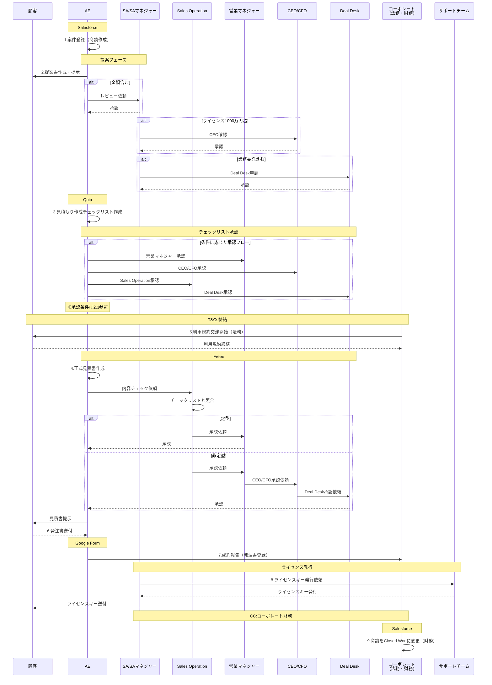

# 見積もりと承認プロセス

## 1. 営業プロセス全体フロー

### 1.1 プロセスフロー図

### 1.2 基本プロセス詳細

#### 1️⃣ 案件登録
- **目的**：商談機会の正式な記録と管理開始
- **オーナー**：AE
- **実施事項**：
  - 顧客情報の登録（企業名、担当者、連絡先）
  - 商談基本情報の入力（案件名、想定金額、製品、Close予定日）
  - 商談ステージをStage1に設定
- **対象システム**：Salesforce
- **ネクストステップ条件**：
  - 必須項目の入力完了
  - Sales Operationへの通知完了

#### 2️⃣ 提案書の作成・提示
- **目的**：顧客課題に対するソリューション提案と価値訴求
- **オーナー**：AE（SAと協働）
- **実施事項**：
  - 提案書の作成（課題、解決策、導入効果、概算金額）
  - SAマネジャーによる技術レビュー
  - 顧客への提案書提示
- **対象ツール**：PowerPoint/Google Slide → 保管：Box
- **ネクストステップ条件**：
  - 金額記載時：SAマネジャー承認取得
  - 1,000万円超：CEO承認取得
  - 業務委託含む：Deal Desk承認取得

#### 3️⃣ 見積もり作成チェックリストの作成
- **目的**：正式見積書作成前の条件整理と社内承認取得
- **オーナー**：AE
- **実施事項**：
  - 見積条件の文書化（製品構成、数量、価格、契約期間、特殊条件）
  - 必要承認者への申請と承認取得
  - Sales Operationへの共有
- **対象ツール**：Quip
- **ネクストステップ条件**：
  - 承認マトリクス（2.3参照）に基づく全承認取得
  - Sales Operationの内容確認完了

#### 4️⃣ 正式見積書の作成・提示
- **目的**：契約締結に向けた正式な価格・条件提示
- **オーナー**：AE
- **実施事項**：
  - Freeeで正式見積書作成
  - Sales Operationによるチェックリストとの照合
  - 承認取得後、顧客への見積書提示
- **対象システム**：Freee
- **ネクストステップ条件**：
  - 定型：営業マネジャー承認
  - 非定型：CEO/CFO/Deal Desk承認
  - 顧客への正式提示完了

#### 5️⃣ T&Cs（利用規約）の締結
- **目的**：法的リスクの回避と契約条件の明確化
- **オーナー**：コーポレート法務（AE支援）
- **実施事項**：
  - 標準T&Csの提示
  - 顧客法務との交渉・調整
  - 最終版の締結と保管
- **対象ツール**：DocuSign → 保管：Box
- **ネクストステップ条件**：
  - 双方の法務確認完了
  - 正式締結（署名完了）

#### 6️⃣ 顧客からの発注書の受領
- **目的**：正式な発注意思の確認と契約成立
- **オーナー**：AE
- **実施事項**：
  - 発注書の受領と内容確認
  - 見積書との整合性チェック（金額、数量、納期）
  - Sales Operation/コーポレートへの共有
- **対象ツール**：メール → 保管：Box
- **ネクストステップ条件**：
  - 発注書の正式受領
  - 見積書との内容一致確認

#### 7️⃣ 成約報告
- **目的**：社内への受注報告と処理開始の通知
- **オーナー**：AE
- **実施事項**：
  - Google Formで発注情報を登録
  - 発注書のアップロード
  - 関係部署への自動通知
- **対象システム**：Google Form → Google Drive
- **ネクストステップ条件**：
  - 全必須項目の入力完了
  - システムからの受領確認

#### 8️⃣ ライセンスキーの発行
- **目的**：顧客への製品提供と利用開始
- **オーナー**：SA
- **実施事項**：
  - サポートチームへの発行依頼
  - ライセンスキーの生成確認
  - 顧客へのメール送付（CC：コーポレート財務）
- **対象システム**：ライセンス管理システム/メール
- **ネクストステップ条件**：
  - ライセンスキー生成完了
  - 顧客への送付完了（CC確認）

#### 9️⃣ 商談のクローズ
- **目的**：受注の正式記録と売上計上の準備
- **オーナー**：コーポレート財務
- **実施事項**：
  - ライセンスキー発行確認
  - SalesforceステータスをClosed Wonに更新
  - 売上計上処理の開始
- **対象システム**：Salesforce
- **ネクストステップ条件**：
  - 全プロセスの完了確認
  - 財務システムへの連携完了

---

## 2. 承認マトリクス

### 2.1 提案書承認

| 条件 | 承認者 | 備考 |
|------|--------|------|
| 金額記載あり | SAマネジャー | 必須 |
| ライセンス1,000万円超 | CEO | 追加承認 |
| 業務委託含む | Deal Desk | SAマネジャー事前承認要 |

### 2.2 見積書承認

| 見積タイプ | Sales Ops確認 | 営業マネジャー | CEO/CFO | Deal Desk |
|------------|---------------|----------------|---------|-----------|
| 定型 | ✓ | ✓ | - | - |
| 非定型（値引き） | ✓ | ✓ | ✓ | - |
| 非定型（特殊条件） | ✓ | ✓ | ✓ | ✓ |

### 2.3 見積もりチェックリスト承認マトリクス

> [!NOTE]
> 見積もり作成チェックリストは、正式見積書作成前に必ず作成し、条件に応じた承認を取得する必要があります。
> CROはSupport Managerまたは営業マネジャーに読み替えてください。

#### 無償ライセンス提供
| 項目 | 内容 | リクエスト | 承認者 | 営業Mgr | Deal Desk | CEO | CFO | Support | CTO |
|------|------|------------|--------|---------|-----------|-----|-----|---------|-----|
| 3ヶ月までの無償ライセンス提供 | nヶ月分 | ☑ | 営業マネジャー/Support Manager | ☑ | - | - | - | - | - |
| 3ヶ月以上の無償ライセンス提供 | nヶ月分 | ☑ | Deal Desk/営業マネジャー/CEO/Support Manager | ☑ | ☑ | ☑ | - | - | - |

#### ディスカウント
| 項目 | 内容 | リクエスト | 承認者 | 営業Mgr | Deal Desk | CEO | CFO | Support | CTO |
|------|------|------------|--------|---------|-----------|-----|-----|---------|-----|
| 15%以下の値引き | n% Discount | ☑ | 営業マネジャー | ☑ | - | - | - | - | - |
| 15%以上の値引き | n% Discount | ☑ | 営業マネジャー/CEO/CFO | ☑ | - | ☑ | ☑ | - | - |

#### プライスホールド・追加ライセンス契約のための下取り・同条件での追加販売
| 項目 | 承認者 | 営業Mgr | Deal Desk | CEO | CFO | Support | CTO |
|------|--------|---------|-----------|-----|-----|---------|-----|
| プライスホールド | Deal Desk/営業マネジャー/CEO | ☑ | ☑ | ☑ | - | - | - |
| 追加ライセンス契約のための下取り | Deal Desk/営業マネジャー/CFO | ☑ | ☑ | - | ☑ | - | - |
| 同条件での追加販売 | Deal Desk | - | ☑ | - | - | - | - |
| ライセンスマイグレーション | Deal Desk/営業マネジャー/CEO/CTO（Support Managerでも可） | ☑ | ☑ | ☑ | - | - | ☑ |

#### 長期契約の締結（3年以上）
| 項目 | 承認者 | 営業Mgr | Deal Desk | CEO | CFO | Support | CTO |
|------|--------|---------|-----------|-----|-----|---------|-----|
| 3年を超える契約 | Deal Desk/営業マネジャー/CEO/Support Manager | ☑ | ☑ | ☑ | - | - | - |

#### 支払い条件の変更
| 項目 | 承認者 | 営業Mgr | Deal Desk | CEO | CFO | Support | CTO |
|------|--------|---------|-----------|-----|-----|---------|-----|
| 支払い条件の変更 | Deal Desk/CFO | - | ☑ | - | ☑ | - | - |
| 支払いサイトの変更 | Deal Desk/CFO | - | ☑ | - | ☑ | - | - |

#### サポートに関わる承認事項
| 項目 | 承認者 | 営業Mgr | Deal Desk | CEO | CFO | Support | CTO |
|------|--------|---------|-----------|-----|-----|---------|-----|
| Technical Support Managerの提供（有償） | Support Manager/CEO | - | - | ☑ | - | ☑ | - |
| Technical Support Managerの提供（無償） | Support Manager/CEO | - | - | ☑ | - | ☑ | - |
| 通常サポートのサービス内容の変更 | Deal Desk/Support Manager/CEO | - | ☑ | ☑ | - | ☑ | - |

#### プロジェクトに関わる承認事項
| 項目 | 承認者 | 営業Mgr | Deal Desk | CEO | CFO | Support | CTO |
|------|--------|---------|-----------|-----|-----|---------|-----|
| プロジェクトの支援契約（コンサル） | CEO | - | - | ☑ | - | - | - |
| プロジェクトの準委任契約 | CEO | - | - | ☑ | - | - | - |
| プロジェクトの請負契約 | CEO | - | - | ☑ | - | - | - |

---

## 3. 特殊プロセス

### 3.1 インセンティブスプリット申請
- **対象**：2名以上のAEが関わる案件
- **申請タイミング**：Stage5進入時
- **申請フロー**：
  1. スプリットを受けるAEがFreeeで申請
  2. スプリットするAEを一次承認者に設定
  3. Sales Ops、CxOの承認を経て財務処理

### 3.2 業務委託契約
- **原則**：業務委託は受けない
- **例外**：
  - **コンサルティング契約（成果物なし）**：SAマネジャー＋CEO承認で可能
  - **その他の業務委託**：Deal Desk承認必須
- **契約書作成**：コーポレート法務が担当

### 3.3 取次店契約
- **定義**：商流に入るのみの契約
- **担当**：Sales Operationチーム
- **方針**：原則として直接契約を推奨
- **申請**：AEがSales Operationに必要性を説明

### 3.4 代理店契約
- **定義**：一次サポートを行う専属チームを持つパートナー
- **承認**：Deal Desk承認必須
- **担当**：Sales Operationチーム

---

## 4. Deal Desk運用

### 4.1 開催情報
- **定例開催**：毎週金曜日
- **臨時開催**：Sales Operation経由で依頼
- **参加者**：COO/CFO、Sales Ops、Legal、Finance、AE/SA（必要時）

### 4.2 審査項目
- 商流（直販/代理店）
- 契約先
- 値引き条件
- 契約形態
- リスク評価
- 収益性

### 4.3 記録管理
- **議事録**：Confluenceに記載
- **承認記録**：Quipに保存

---

## 5. ツールと文書管理

| プロセス | 使用ツール | 保管場所 |
|----------|------------|----------|
| 案件管理 | Salesforce | - |
| 提案書 | PowerPoint/Google Slide | Box |
| 見積もりチェックリスト | Quip | Quip |
| 正式見積書 | Freee | Freee/Box |
| 契約書 | DocuSign | Box |
| 発注書 | Google Form | Google Drive |
| Deal Desk議事録 | Confluence | Confluence |

---

## 6. 注意事項

> [!IMPORTANT]
> - 見積もり作成チェックリストの事前作成は必須
> - T&Csは全案件で締結必須（例外なし）
> - ライセンスキー送付時は必ずコーポレート財務をCCに入れる
> - Deal Deskは審査機関、WPSは推進会議として明確に区別

> [!NOTE]
> 関連文書：
> - [Deal DeskとWPS](./04_Deal_DeskとWPS.md)
> - [インセンティブ申請](./06_インセンティブ申請.md)
> - [命名規則の統一基準](./09_命名規則の統一基準.md)