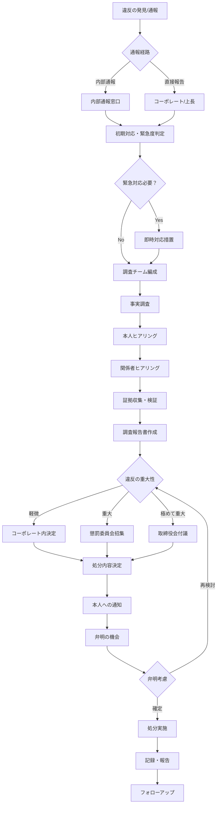

# 罰則決定プロセス

## 1. プロセス概要

罰則の決定は、違反の発見・通報から始まり、調査、審議、決定、実施まで、公正かつ透明性のあるプロセスに従って行われます。

---

## 2. プロセスフロー図

---

## 3. 各段階の詳細

### 3.1 通報・発見段階

#### 通報経路

**内部通報窓口**
- 専用メールアドレス：compliance@scalar-labs.com
- 専用ホットライン：（内線番号）
- 外部弁護士窓口：（連絡先）
- 匿名通報システム：（URL）

**直接報告**
- 直属上長への報告
- コーポレート部門への直接連絡
- 人事部への相談

#### 通報者の保護
- 通報者の秘密厳守
- 報復行為の禁止（報復は即懲戒処分）
- 匿名通報の許可

### 3.2 初期対応段階

#### 緊急度判定基準

| 緊急度 | 該当事例 | 対応時限 |
|--------|---------|----------|
| 最高 | 犯罪行為、重大ハラスメント | 即日 |
| 高 | 顧客への影響あり、継続的ハラスメント | 24時間以内 |
| 中 | 内部規程違反、単発的不適切行為 | 3営業日以内 |
| 低 | 軽微な違反、過失 | 1週間以内 |

#### 即時対応措置
- 被害拡大防止（当事者の分離等）
- 証拠保全命令
- 関係部署への通知

### 3.3 調査段階

#### 調査チームの編成

**構成メンバー**
- リーダー：コーポレート責任者
- メンバー：
  - 人事部門担当者
  - 法務担当者
  - 関連部門マネジャー
  - 必要に応じて外部専門家（弁護士、会計士等）

**利害関係者の除外**
- 当事者と親族関係
- 直接の上下関係
- 同一案件の関係者

#### 調査の実施

**事実調査の原則**
- 客観的証拠の重視
- 複数証言の照合
- 時系列での事実整理
- 中立性の維持

**本人ヒアリング**
- 実施時期：証拠収集後
- 同席者：本人が希望する場合は1名可
- 記録方法：書面および音声記録（本人同意必須）
- 確認事項：
  - 事実関係の確認
  - 動機・背景の聴取
  - 反省・改善意思の確認

**関係者ヒアリング**
- 対象：目撃者、被害者、関係部署
- 秘密保持の徹底
- 誘導的質問の禁止

### 3.4 審議・決定段階

#### コーポレート内決定（レベル1-2相当）

**決定者**
- コーポレート責任者（CFO/COO）
- 人事部門長
- 当該部門長

**決定基準**
- 過去の類似事例との均衡
- 本人の勤務態度・成績
- 反省の度合い

#### 懲罰委員会での決定（レベル3-5相当）

**委員会構成**
- 委員長：CEO または指名者
- 委員：
  - CFO
  - 人事担当役員
  - 法務担当役員
  - 外部有識者（必要に応じて）

**開催要件**
- 定足数：委員の2/3以上の出席
- 決議：出席委員の過半数（委員長は可否同数時のみ投票）

**審議事項**
- 調査報告書の検証
- 処分案の検討
- 再発防止策の策定

#### 取締役会付議（レベル6相当）

**付議基準**
- 役員の懲戒
- 懲戒解雇
- 1,000万円以上の損害賠償

### 3.5 通知・弁明段階

#### 本人への通知

**通知内容**
- 認定された事実
- 適用される就業規則の条項
- 処分内容（案）
- 弁明の機会の告知

**通知方法**
- 書面による通知（内容証明郵便）
- 面談による説明

#### 弁明の機会

**実施時期**
- 通知から7日以内

**弁明方法**
- 書面提出
- 弁明聴取会への出席
- 代理人の同席可

**弁明の考慮**
- 新事実の提出 → 再調査
- 情状酌量の要素 → 処分軽減の検討
- 不服申立て → 再審議

### 3.6 実施段階

#### 処分の実施

**実施時期**
- 弁明期間終了後、速やかに
- 給与関連：翌月から反映
- 人事異動：2週間以内

**実施手続き**
- 辞令交付
- 人事記録への記載
- 関係部署への通知

#### 公表

**社内公表**
- 原則：個人を特定できない形で周知
- 例外：見せしめ効果が必要な重大違反

**社外公表**
- 法令に基づく開示
- 顧客への影響がある場合

---

## 4. タイムライン

### 4.1 標準処理期間

| プロセス | 標準期間 | 最大期間 |
|----------|---------|----------|
| 初期対応 | 1-3日 | 1週間 |
| 調査 | 2週間 | 1ヶ月 |
| 審議・決定 | 1週間 | 2週間 |
| 弁明期間 | 1週間 | 2週間 |
| 実施 | 即日-2週間 | 1ヶ月 |
| **合計** | **約1ヶ月** | **2.5ヶ月** |

### 4.2 迅速処理案件

以下の場合は迅速処理（2週間以内）：
- 本人が事実を認め、争わない場合
- 継続的な被害防止が必要な場合
- 明白な証拠がある場合

---

## 5. 記録と報告

### 5.1 記録の作成

**作成する記録**
- 通報記録
- 調査報告書
- 審議議事録
- 処分決定書
- 実施記録

**保管期間**
- 軽微な違反：3年
- 重大な違反：10年
- 懲戒解雇：永久保存

### 5.2 報告

**定期報告**（四半期）
- 取締役会への報告
- 違反件数、種類、処分内容の統計

**個別報告**
- 重大事案：即時報告
- 監査役への報告

---

## 6. フォローアップ

### 6.1 処分後のモニタリング

| 期間 | 実施事項 |
|------|----------|
| 1ヶ月後 | 改善状況確認 |
| 3ヶ月後 | 中間評価 |
| 6ヶ月後 | 最終評価 |

### 6.2 再発防止

- 原因分析
- 制度・プロセスの見直し
- 教育・研修の実施
- 好事例の水平展開

---

## 7. 不服申立て

### 7.1 申立て方法

- 処分通知から14日以内
- 書面による申立て
- 新証拠または手続き違反の指摘

### 7.2 再審査

- 別の審査チームによる再調査
- 30日以内に結論
- 最終決定（再申立て不可）

---

> [!IMPORTANT]
> すべての関係者は、調査への協力義務があります。
> 虚偽の証言や調査妨害は、それ自体が懲戒対象となります。

> [!WARNING]
> 処分決定プロセスの公正性を損なう行為（圧力、根回し、隠蔽等）は、
> 原処分より重い処分の対象となります。

> [!NOTE]
> 関連文書：
> - [01_罰則の種類と定義](./01_罰則の種類と定義.md)
> - [02_対象事項と違反内容](./02_対象事項と違反内容.md)
> - [04_内部通報制度](./04_内部通報制度.md)